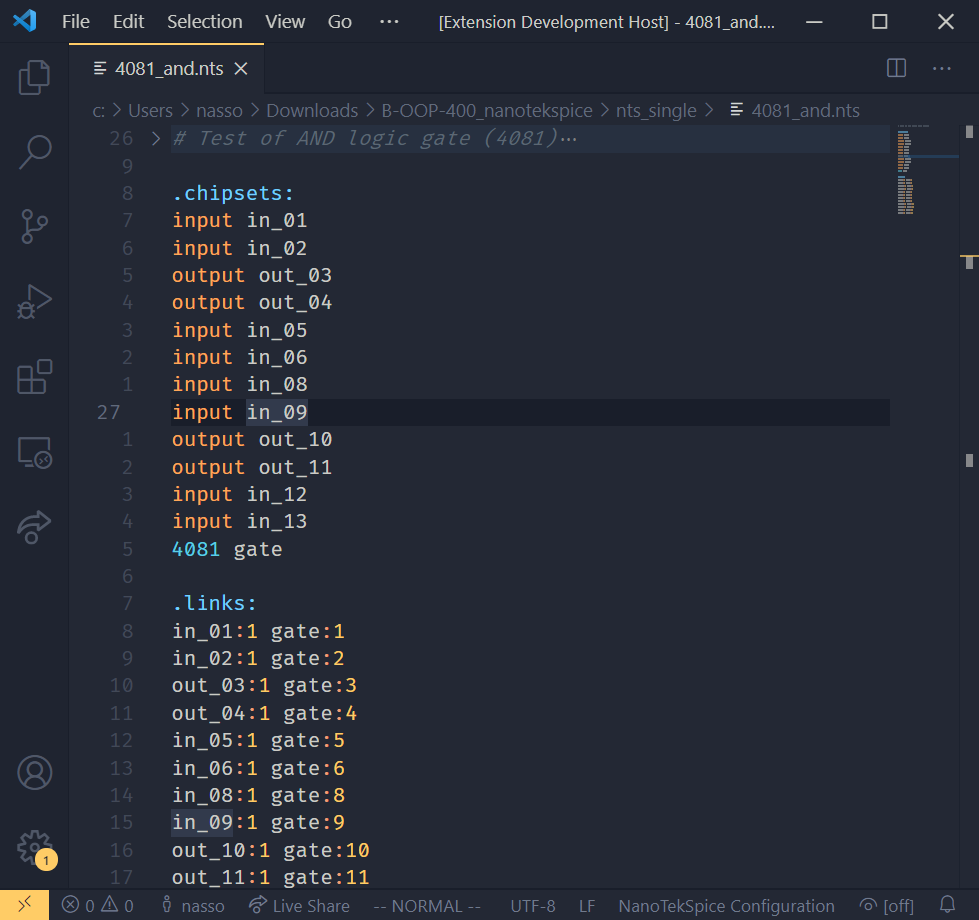

# tekspice README

Adds language support (syntax + folding) for the NanoTekSpice configuration file
format, as described in the official subject for the Epitech project (v3.0).

## Preview

Theme used: [Ayu Dark][Ayu]

[Ayu]: https://marketplace.visualstudio.com/items?itemName=teabyii.ayu

## Release Notes

### 0.1.0

Initial release
- Language grammar
- Folding support for sections and comment blocks
